# Davora

Davora is a Nextcloud-focused PWA for browsing and modifying files through a normalized Worker API. Accounts are connected inside the app, multiple accounts are supported, and the browser never talks to WebDAV directly.

## Open-source and release posture
- License: MIT (`LICENSE`).
- OSS/operator release guidance: `docs/DEPLOYMENT.md`.
- Davora is a deployed application workspace, not an npm package publish target.
- Canonical deploy entry points live at the repo root: `npm run deploy:web`, `npm run deploy:worker`, and `npm run deploy`.

## What you need
- Node.js 22+.
- npm.
- `npm install` so the repo-pinned Wrangler CLI is available for root deploy scripts.
- Wrangler CLI on `PATH` if you want to run the exact raw operator smoke command `cd apps/worker && wrangler dev` outside npm.
- Google Chrome for Playwright browser checks.
- Optional: a real Nextcloud app password if you want live validation.

## Local modes
### Mock mode
Use this for normal local development, deterministic tests, and UI validation.
- `MOCK_BACKEND=true`
- No real Nextcloud credentials required at server start.
- The app still asks for base URL / username / app password in-browser, but mock mode accepts placeholder values and exercises the same in-app account flow.
- Optional `APP_UNLOCK_CODE` lets you test the unlock bootstrap flow locally.

### Real mode
Use this only when validating the Worker against a live Nextcloud instance.
- `MOCK_BACKEND=false`
- Worker startup requires `SESSION_SECRET`; `NEXTCLOUD_ALLOWED_HOSTS` is optional and an empty value allows any valid Nextcloud host while preserving the existing URL-safety checks.
- Account credentials are entered in-app or passed only to the real-validation script.
- Keep `NEXTCLOUD_ROOT_PATH=.davora-agent-test` for automated live validation safety.

## Environment setup
1. Copy `.env.example` to `.env`.
2. Fill in these required values:
   - always: `SESSION_SECRET`
   - mock mode: `MOCK_BACKEND=true`
   - real mode: `MOCK_BACKEND=false`
3. Optional values:
    - `APP_UNLOCK_CODE`: if set, the web app will ask for an unlock code before creating an account session.
    - `NEXTCLOUD_ALLOWED_HOSTS`: optional comma-separated hostname allowlist. Leave it empty to allow any valid Nextcloud host.
    - `NEXTCLOUD_BASE_URL`, `NEXTCLOUD_USERNAME`, `NEXTCLOUD_APP_PASSWORD`: only needed for `rtk npm run validate:real`.
    - `LOCAL_DEV_STATE_PATH`: overrides the local Node worker account-store file. Default: `.tmp/local-dev/worker-state.json`.
    - `VITE_OPENED_FILE_CACHE_LIMIT_BYTES`: overrides the browser opened-file cache limit.
    - `SESSION_TTL_SECONDS`, `NEXTCLOUD_MAX_FILE_BYTES`, `NEXTCLOUD_MAX_TEXT_FILE_BYTES`.

## Account and session behavior
- On bootstrap, the app checks `GET /api/health` and then either shows the first-run zero state or restores existing connected-account metadata from browser storage.
- Users connect Nextcloud accounts inside the app using base URL, username, app password, and optional label.
- Multiple accounts can be connected and switched inside the same app instance.
- The persistent shell keeps only a minimal online/offline badge and a `Profile & settings` entry point; account switching/details and cache controls live behind that one-click settings surface.
- Once an account is connected, the in-app header drops the persistent `Davora` wordmark so status, current location, install, settings, and transfer affordances keep that space instead.
- The browser stores only non-secret account metadata plus account-bound session tokens; it does **not** persist raw app passwords in local storage, IndexedDB, or the service-worker cache.
- Local Node-worker development persists connected-account material in an encrypted file at `.tmp/local-dev/worker-state.json` by default, so restarting `npm run dev` keeps the same browser/account pairing usable without re-entering the app password.
- Folder/search/opened-file cache data is partitioned by account namespace so accounts do not bleed into each other.
- File sizes default to human-readable units and can be switched between Human readable / KB / MB / GB from the file-list toolbar or `Profile & settings`.
- Opened-file cache limit uses a 1 MB–8 GB slider plus a manual MB input, and a separate max-cacheable-file-size control defaults to 15 MB so larger files can still open without persisting their full blobs offline.
- Unsupported file types skip the dead-end preview layer and trigger browser download/open fallback behavior instead.
- Audio preview remembers the last known playback position on a best-effort basis per browser account + file path; when no usable saved position exists, it simply starts from `0:00` without claiming resume.
- Breadcrumbs use a home-icon root with slash separators, replacing redundant `All files` / `Up one level` controls where breadcrumb navigation already covers the path.
- Video preview uses muted inline autoplay for the most reliable browser-compatible behavior.
- A normal local dev restart preserves connected accounts and now retries transient bootstrap/session startup races before falling back; explicit worker state resets, secret changes, or non-local runtimes still surface reconnect-required honestly.
- If a local relaunch happens while the browser still carries a stale reconnect-required marker, Davora now retries restoration first and clears that stale state automatically once the worker can recreate the session.
- If `APP_UNLOCK_CODE` is configured, the app shows an unlock screen after account connection but before creating the account session.
- The app now keeps installability honest without interrupting first run: onboarding stays clear, the browser-native install opportunity becomes a contextual `Install app` action once a workspace is active, and the non-essential offline-ready success toast is suppressed instead of behaving like a global prompt.
- Preview-build offline behavior is explicit: the service worker keeps the installable shell available, cached account data stays usable after it has been opened online first, installed standalone launches reuse that cached shell instead of blanking white when the local server is down even if the browser still reports online connectivity, and uncached account state falls back to the normal zero-state instead of pretending offline data exists.
- The update toast is now specific to a ready app-shell update, and accepting it waits for the new service worker to take control before reloading so the new build/content is actually active.
- Vite development mode intentionally suppresses update toasts even if the dev service worker restarts, because those restarts are not a real release signal; the real update path is validated in the preview-build PWA flow.

## Run locally
### Start both apps
```bash
rtk npm run dev
```
- Worker: `http://127.0.0.1:8787`
- Web app: `http://127.0.0.1:4173`
- Normal browser traffic uses same-origin `/api` on the web origin; Vite proxies that path to the local worker so day-to-day dev does not depend on browser CORS allowlists.

### Start only one side
```bash
rtk npm run dev:worker
rtk npm run dev:web
```

### Start the Worker through Wrangler
```bash
cd apps/worker && wrangler dev
```
- The repo ships a safe mock-only `apps/worker/.dev.vars`, so once Wrangler is installed and on `PATH`, this exact command works for local runtime smoke checks without extra app-specific setup.
- For custom local values, pass an ignored env file explicitly with `wrangler dev --env-file path/to/file`.

## Validate locally
Run the required validation commands from the repo root:
```bash
rtk npm run typecheck
rtk npm test
rtk npm run build
rtk npm run test:pwa
rtk npm run test:e2e
```

`rtk npm run test:pwa` is the dedicated preview-build PWA/installability path: it verifies the generated manifest, service-worker control, Chrome installability (excluding the automation-only `in-incognito` warning), honest offline behavior for both primed-cache and uncached reloads, and should be paired with the default `rtk npm run dev` Chrome/DevTools check when installability feedback is under review.

`rtk npm run test:e2e` runs the Playwright browser suite and then refreshes the checked-in screenshot artifacts.

Optional real-backend validation:
```bash
rtk npm run validate:real
```
This script provisions and deletes data only inside `.davora-agent-test`, then exercises the real Worker through the in-app account connect + session + list/file/search/move/copy/create-folder/upload/delete flow. If `NEXTCLOUD_APP_PASSWORD` is restored in the project-root `.env`, rerun this command before carrying forward any older “blocked on missing secret” note.

## Deploy to Cloudflare
The deployed topology is explicit:
- `apps/worker` deploys via Wrangler as the API origin.
- `apps/web/dist` deploys to Cloudflare Pages.
- Pages builds need a deployed Worker origin because the local same-origin `/api` proxy does not exist on Pages. The root deploy script now defaults that origin to `https://davora.xyofn8h7t.workers.dev`, defaults the Pages project name to `davora`, and refuses to deploy the Worker if required runtime secrets such as `SESSION_SECRET` are missing.
- Worker observability is part of the standard release posture through `apps/worker/wrangler.toml`; use `cd apps/worker && wrangler tail davora --format pretty` when you need operator-facing live logs.

Required root scripts:

```bash
npm run deploy:worker -- --dry-run
npm run deploy:web
npm run deploy
```

- `npm run deploy:worker -- --dry-run` is the required Worker preflight.
- `npm run deploy:web` builds the exact Pages artifact with the default deployed Worker origin unless `VITE_API_BASE_URL` is overridden, then runs `wrangler pages deploy apps/web/dist --project-name davora` unless `CLOUDFLARE_PAGES_PROJECT_NAME` overrides it.
- `npm run deploy` is the combined root entry point.
- Full operator details, env knobs, and future guardrails live in `docs/DEPLOYMENT.md`.

## UX source of truth
- Design source of truth: `docs/FILE_MANAGER_REDESIGN_BRIEF.md`
- Review/process gate: `docs/UI_QUALITY_GATE.md`

## Current screenshot evidence
Checked-in screenshots under `docs/screenshots/` are the visual evidence for the current multi-account foundation.

### First-run zero state
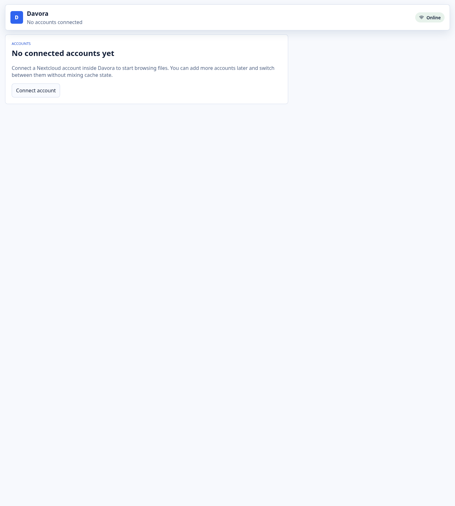
_The app starts with an explicit Connect account CTA instead of assuming server-launch credentials._

### Connected workspace
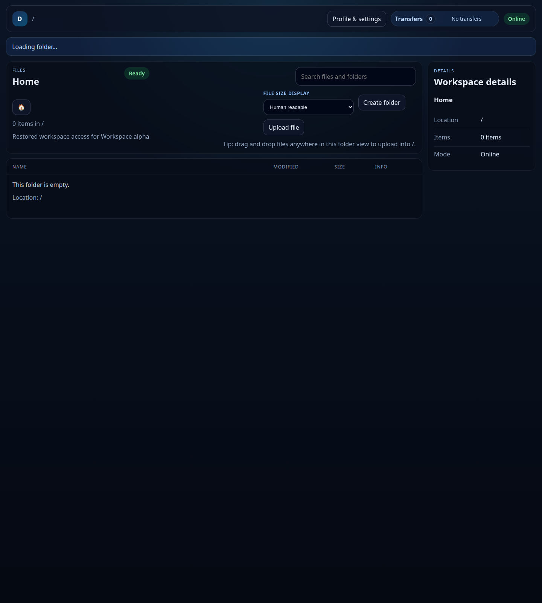
_The active account stays visible while the file-manager workspace remains the dominant surface._

### Account switching context
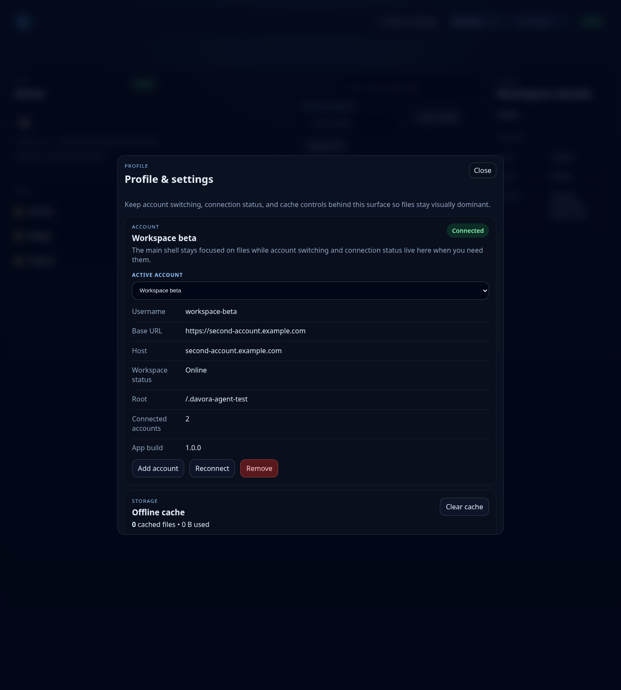
_The main shell stays light while account switching remains explicit and safe._

### Profile & settings
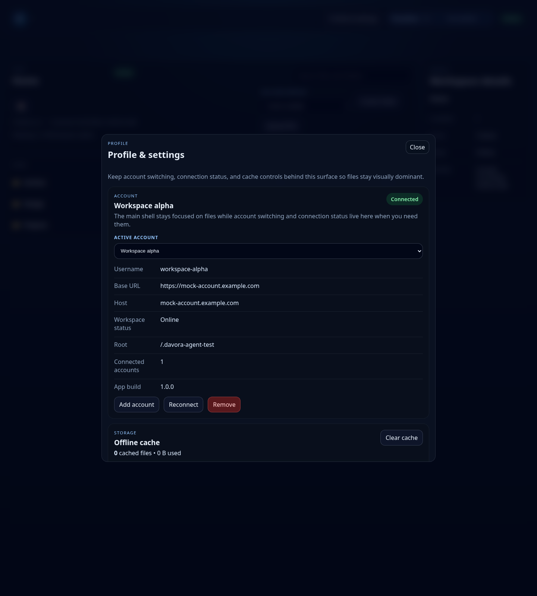
_Account details/actions and cache controls now live behind one practical settings entry point while file-size mode stays in the main workspace header._

### Browse + PDF preview workspace
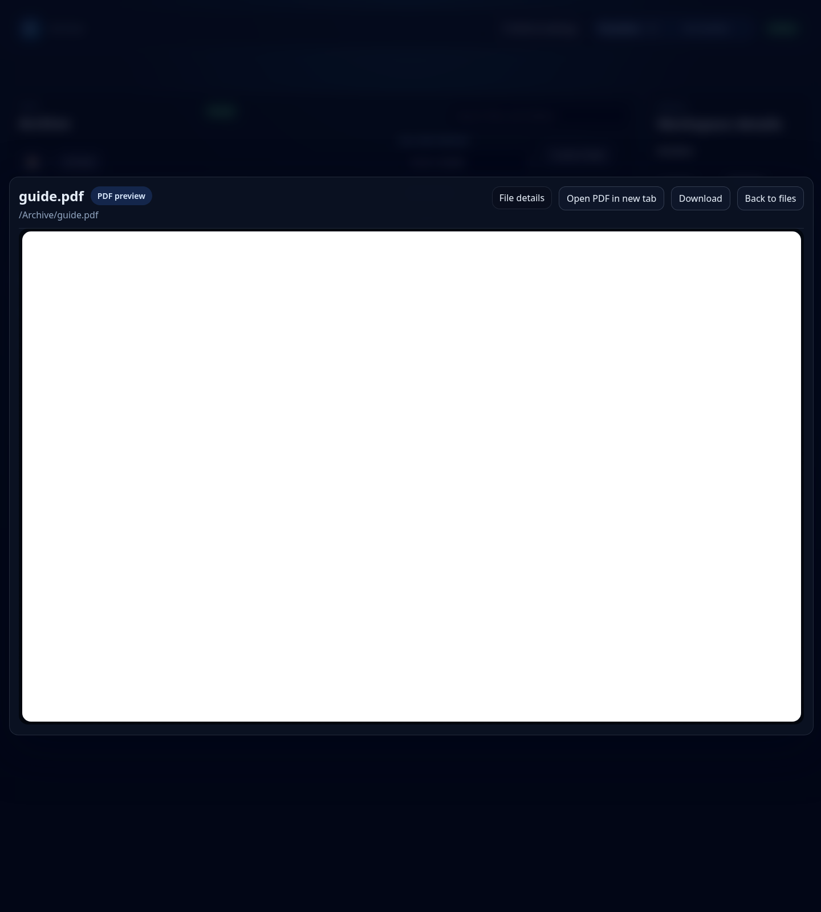
_The connected shell now uses that top-row space for location/status/actions instead of a persistent `Davora` wordmark, while PDF preview keeps clear back, file, and action context._

### Focused preview overlay
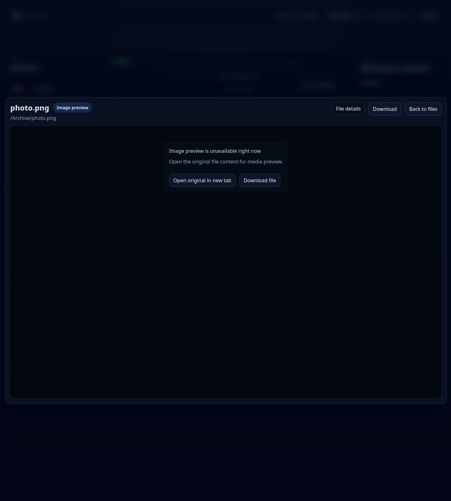
_Focused preview keeps content dominant, and audio reopen now resumes from the last remembered position only when the browser can restore it honestly._

### Mutation controls
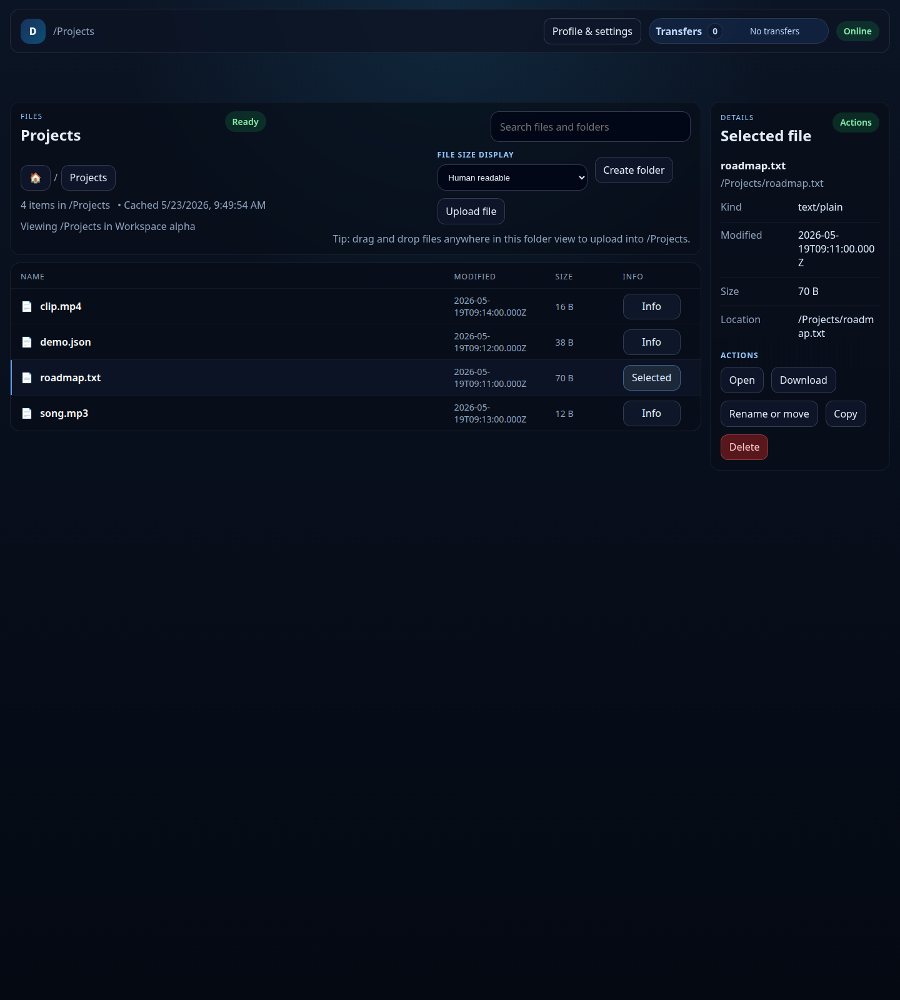
_Clearer Info/open controls keep browsing and contextual actions distinct._

### Unlock-required state
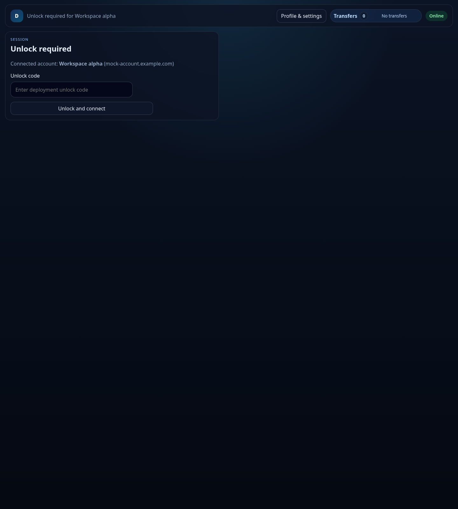
_Unlock remains a focused gate instead of pushing the file surface around._

### Error state
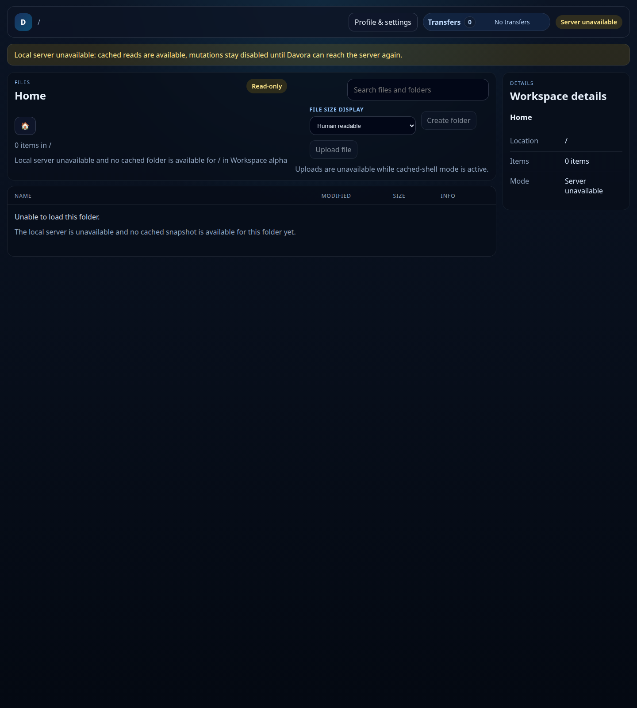
_Recoverable failures stay visible in a stable top-area slot without collapsing the workspace._

### Reconnect-required state
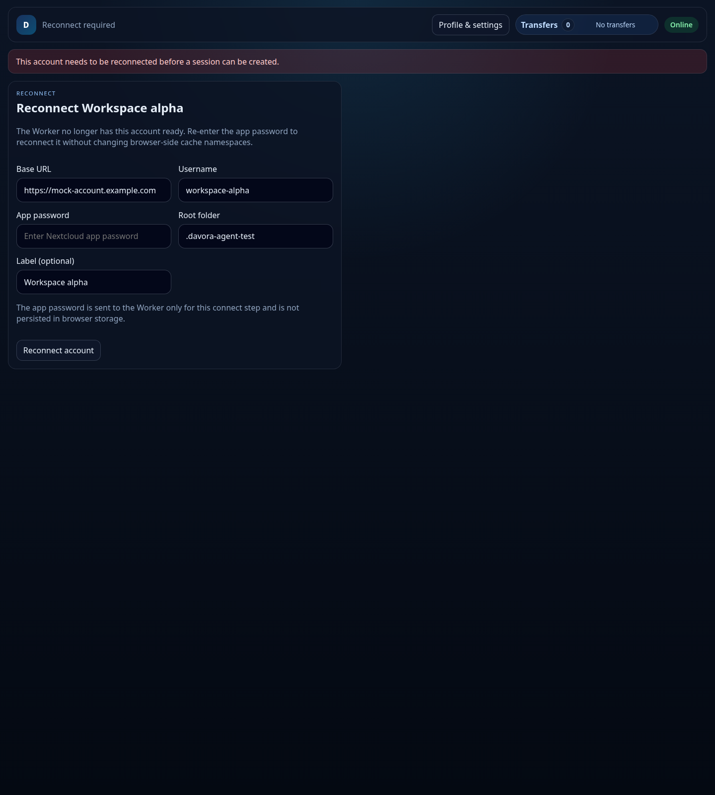
_When Worker-side account material is gone, the UI asks for reconnect instead of silently reusing the wrong state._

### Mobile browse workspace
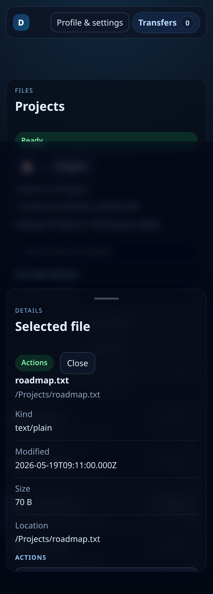
_Mobile keeps browsing first while preserving account-aware state and the bottom-sheet details flow._

## Manual validation checklist
### Mock mode
1. Start `rtk npm run dev` with `MOCK_BACKEND=true`.
2. Open the app and confirm the zero state appears.
3. Connect a mock account and confirm the file-manager workspace loads.
4. Add a second account from `Profile & settings` and switch between them there instead of from an always-visible page-level selector.
5. Open `Profile & settings` and verify account details/actions plus cache controls live there while file-size mode remains in the main workspace header.
6. Use the file-list header file-size control and verify Human readable / KB / MB / GB updates list/details/preview sizes immediately.
7. In `Profile & settings`, verify the opened-file cache limit can be changed with the slider and manual MB input, and that max-cacheable-file-size defaults to 15 MB.
8. Open text, markdown, image/video, and PDF files; verify preview keeps Back/Close context, larger media space, lighter file details, and muted inline autoplay for video.
9. Open `Projects/song.mp3`, move playback forward, close it, reopen it in the same browser/account, and verify the preview resumes best-effort from the remembered position; if browser restore is unavailable, it should simply start from `0:00` without any false resume message.
10. After connecting an account, verify the in-app chrome no longer shows a persistent `Davora` wordmark while `Profile & settings`, transfers, install (when offered), and status/location context remain usable.
11. Confirm markdown still renders when the MIME type includes charset variants such as `text/markdown;charset=UTF-8`.
12. Open an unsupported file such as `Archive/image.bin`; verify the browser downloads it instead of opening a dead-end preview screen.
13. Open settings/create-folder/preview overlays and verify clicking outside closes them.
14. Open a child folder and verify breadcrumbs show a home root plus slash-separated segments, with no redundant `All files` / `Up one level` buttons beside them.
15. Create/upload/rename/copy/delete inside the active account.
16. Go offline and confirm cached reads still work while mutation controls stay disabled.
17. In the default `rtk npm run dev` flow, open Chrome DevTools and confirm `/manifest.webmanifest` is valid, the service worker controls the page after one reload, and Chrome reports no installability blockers beyond automation/incognito noise.
18. Run `rtk npm run test:pwa` and confirm the preview build reports a valid manifest/service worker/installability path plus honest offline behavior.
19. Restart `rtk npm run dev` and confirm the previously connected account still boots without re-entering credentials.
20. In the preview-build PWA flow, install the app, stop the local server while Chrome still stays online, relaunch the installed app, and confirm the cached shell/workspace opens instead of a white screen or restore dead-end.
21. In the preview-build PWA flow, rebuild with a different `VITE_APP_BUILD_LABEL`, accept the update toast, and confirm `Profile & settings` shows the new build label afterward.
22. Trigger the explicit mock reset and confirm reconnect-required still appears because the worker-side store was intentionally cleared.
23. Remove an account and confirm its local view/cache state is gone.
24. Run `cd apps/worker && wrangler dev` and confirm `http://127.0.0.1:8787/api/health` reports mock mode with `configLoaded: true`.
25. Run `npm run deploy:worker -- --dry-run` and confirm the Worker bundle completes without unresolved Node-compat warnings.
26. Run `npm run deploy:web` and confirm the Pages path builds `apps/web/dist` before attempting upload. Override `VITE_API_BASE_URL` only when targeting a different deployed Worker origin or `CLOUDFLARE_PAGES_PROJECT_NAME` only when targeting a non-default Pages project.
27. If Cloudflare rejects the Pages upload because auth, account access, or the target project is missing, record that exact external blocker instead of marking the deploy path unverified.

### Unlock flow
1. Set `APP_UNLOCK_CODE` in `.env`.
2. Restart `rtk npm run dev`.
3. Connect an account and confirm the unlock screen appears before folder data loads.
4. Enter a wrong code and verify the invalid-code guidance appears.
5. Enter the correct code and confirm the normal app loads.

## Safety notes
- Never commit `.env` or real credentials.
- Do not broaden automated real validation outside `.davora-agent-test`.
- `rtk npm run validate:real` is the only supported write path for live validation and it intentionally cleans up after itself.
- The repo may contain ignored `.tmp/` helper artifacts from prior audits; they are not source of truth.
