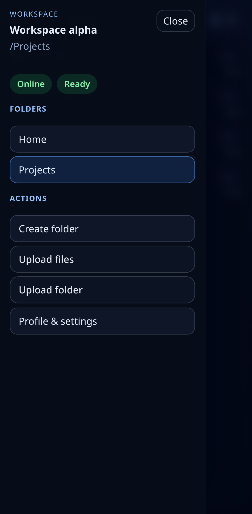
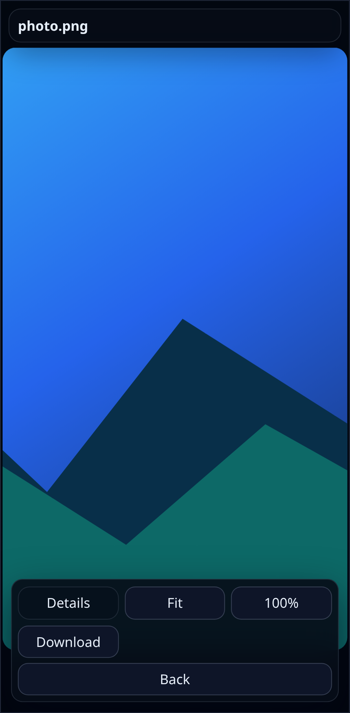

# UX Review

## 2026-06-05 Packet 13 UX refinement loop status

Status: IN PROGRESS. The deployed Packet 13 UX checkpoint is green through the browse-density follow-up. Broader manual/user review is still open.

User feedback driving this loop:
- Nextcloud's current UX still feels better in important ways: actions are tappable near the bottom, the file list stays at the top, and navigation/menu behavior feels more spatially natural.
- Davora screenshots showed visible issues: image preview too small or unavailable, cached-preview messaging consuming too much screen, file details occupying prime preview space, and mobile layout not optimizing screen usefulness.

Current design direction:
- Keep file browsing as the primary surface.
- Keep desktop browse controls in a compact file-manager toolbar so the list starts high on the page.
- Keep idle desktop browse headers to one compact row when possible; item counts and status should not create a separate vertical band unless there is actual stale/search context to show.
- Avoid redundant root-folder navigation chrome; breadcrumbs stay useful in subfolders but the root view should not spend vertical space on a home-only breadcrumb row.
- Make mobile selected-item surfaces action-first; details should not compete with actions or the file list.
- Move compact mobile navigation into a real inert off-canvas left drawer so the file list keeps the top of the viewport while workspace/menu actions stay spatially clear.
- Keep mobile folder headers compact; secondary breadcrumb/cache details should not push the list down when the drawer already covers navigation, and mobile browse should use a one-row title/search toolbar rather than a large folder card.
- Keep the mobile app bar compact too: persistent controls such as transfers should be icon/count surfaces, not wide text buttons, while preserving accessible names and popovers.
- Keep selected-file mobile actions compact and bottom-docked; primary actions should be visible without turning the details surface into another large panel.
- Keep repeated mobile row controls icon-sized when the control's meaning is familiar and the accessible label can carry the full action name.
- Keep focused mobile preview controls compact: closed details, Fit/Fill, download, and back controls should fit in one bottom row so the preview image gets more vertical room while still allowing whole-image inspection.
- Keep the desktop right details rail contextual; it should appear for selected file/folder or batch-download work, not as an always-visible generic workspace panel on idle root browsing.
- Make preview an explicit focused mode with content taking most available space.
- Keep preview details behind disclosure and move cache/loading/error notices into compact floating status surfaces.
- Prefer browser-rendered evidence over code-only judgment.

Evidence and validation so far:
- `npm run typecheck`: PASS.
- `npm test`: PASS.
- `npm test --workspace=@davora/web -- src/App.test.tsx`: PASS after adding mobile drawer coverage.
- `npm run build`: PASS.
- `PLAYWRIGHT_CHROME_EXECUTABLE=/usr/bin/chromium-browser npm run test:screenshots`: PASS; latest run passed 13, skipped 13, and refreshed compact mobile browse/action-sheet, mobile navigation drawer, and mobile focused-preview evidence.
- `PLAYWRIGHT_CHROME_EXECUTABLE=/usr/bin/chromium-browser npm run test:pwa`: PASS; the previous port-conflict gap is closed, including preview-build installability, offline cached account reuse, honest uncached offline fallback, update prompt application, and installed-shell stopped-worker behavior.
- `npm run validate:real`: PASS with the updated project-root `.env` testing account, constrained to `.davora-agent-test`.
- Headed Chromium/CDP: PASS for launch and endpoint verification. Chromium was started with `--user-data-dir=/tmp/davora-chrome-cdp --remote-debugging-port=9222`, and `http://127.0.0.1:9222/json/version` returned Chrome/CDP metadata.
- PDF preview-card follow-up: PASS. `PLAYWRIGHT_CHROME_EXECUTABLE=/usr/bin/chromium-browser npm run test:screenshots` passed 13/13 and refreshed `docs/screenshots/davora-browse-preview.png` with the intentional PDF card instead of a blank PDF pane; `npm test --workspace=@davora/web -- src/App.test.tsx` passed 40/40; the full `npm run typecheck`, `npm test`, `npm run build`, and `PLAYWRIGHT_CHROME_EXECUTABLE=/usr/bin/chromium-browser npm run test:pwa` path passed.
- Compact mobile action-sheet follow-up: PASS. `npm test --workspace=@davora/web -- src/App.test.tsx` passed 40/40, `PLAYWRIGHT_CHROME_EXECUTABLE=/usr/bin/chromium-browser npm run test:screenshots` passed 13/13 and refreshed `docs/screenshots/davora-mobile-browse.png`, `npm run typecheck`, `npm test`, `npm run build`, and `PLAYWRIGHT_CHROME_EXECUTABLE=/usr/bin/chromium-browser npm run test:pwa` passed 6/6.
- Compact mobile row-control follow-up: PASS. Mobile file rows now show a compact circular `i` details control instead of wide text buttons while preserving accessible labels; `npm test --workspace=@davora/web -- src/App.test.tsx` passed 40/40, `PLAYWRIGHT_CHROME_EXECUTABLE=/usr/bin/chromium-browser npm run test:screenshots` passed 13/13 and refreshed `docs/screenshots/davora-mobile-browse.png`, `npm run typecheck`, `npm test`, `npm run build`, and `PLAYWRIGHT_CHROME_EXECUTABLE=/usr/bin/chromium-browser npm run test:pwa` passed 6/6.
- Idle-details-rail follow-up: PASS. The desktop right details rail is hidden while browsing without a selected file/folder or batch-download selection. `rtk npm run typecheck`, `rtk npm test --workspace=@davora/web -- src/App.test.tsx` 40/40, `rtk npm test`, `rtk npm run build`, `PLAYWRIGHT_CHROME_EXECUTABLE=/usr/bin/chromium-browser npm run test:pwa` 6/6, and `PLAYWRIGHT_CHROME_EXECUTABLE=/usr/bin/chromium-browser npm run test:screenshots` 13/13 passed.
- Browse-density follow-up: PASS. Desktop browse title/count/status/actions now share one compact row, desktop rows are tighter, and mobile browse spacing is slightly reduced while preserving the action-first bottom sheet and detail controls. `rtk npm test --workspace=@davora/web -- src/App.test.tsx` 40/40, `PLAYWRIGHT_CHROME_EXECUTABLE=/usr/bin/chromium-browser npm run test:screenshots` 13/13, `rtk npm run typecheck`, `rtk npm test`, `rtk npm run build`, and `PLAYWRIGHT_CHROME_EXECUTABLE=/usr/bin/chromium-browser npm run test:pwa` 6/6 passed.
- Final visual-polish loop: PASS. Browser evidence now shows the mobile drawer with upload actions, the mobile selected-file tray as a compact non-modal bottom action surface with a circular close control, a sticky list header, and consistent drawer action styling. `PLAYWRIGHT_CHROME_EXECUTABLE=/usr/bin/chromium-browser npm run test:screenshots` passed 13/13; `rtk npm test --workspace=@davora/web -- src/App.test.tsx` passed 40/40; `rtk npm run typecheck`, `rtk npm test`, `rtk npm run build`, and a clean `PLAYWRIGHT_CHROME_EXECUTABLE=/usr/bin/chromium-browser npm run test:pwa` passed 6/6. No further obvious high-impact UX polish was found from the refreshed screenshots in this loop. The pass was redeployed via `npm run deploy` without committing: Worker version `7f3f7517-ae92-4747-a8c4-9548bc86f4f0` and Pages `https://4645a5eb.davora.pages.dev`; verified Worker health and Pages HTTP 200.
- Single-line mobile app bar follow-up: PASS. Browser evidence now shows a one-line mobile app bar with hamburger menu, up-one-level arrow, truncated folder title, compact search input, and transfer tray, with no D icon and no redundant browse header, so the file list starts immediately below the app bar. `PLAYWRIGHT_CHROME_EXECUTABLE=/usr/bin/chromium-browser npm run test:screenshots` passed 13/13; `rtk npm test --workspace=@davora/web -- src/App.test.tsx` passed 40/40; `rtk npm run typecheck`, `rtk npm test`, `rtk npm run build`, and `PLAYWRIGHT_CHROME_EXECUTABLE=/usr/bin/chromium-browser npm run test:pwa` passed 6/6. Redeployed via `npm run deploy` without committing: Worker version `fb101130-53a1-4b2c-b12d-d14e331e28d4` and Pages `https://ba4bdee2.davora.pages.dev`; verified Worker health and Pages HTTP 200.
- Collapsed mobile search follow-up: PASS. Browser evidence now shows the default mobile app bar with a compact search icon and readable folder title; `davora-mobile-search-expanded.png` shows tap-to-expand search occupying the app-bar row with a close control. `PLAYWRIGHT_CHROME_EXECUTABLE=/usr/bin/chromium-browser npm run test:screenshots` passed 13/13; `rtk npm test --workspace=@davora/web -- src/App.test.tsx` passed 40/40; `rtk npm run typecheck`, `rtk npm test`, `rtk npm run build`, and `PLAYWRIGHT_CHROME_EXECUTABLE=/usr/bin/chromium-browser npm run test:pwa` passed 6/6. Redeployed via `npm run deploy` without committing: Worker version `0ae2802b-d470-4c53-8636-2de14a34033c` and Pages `https://6bc07fbd.davora.pages.dev`; verified Worker health and Pages HTTP 200.
- Mobile long-press batch-selection follow-up: PASS. Browser evidence now shows direct long-press batch selection, visible selected checkboxes, and a persistent bottom toolbar with selected count, Download, and Clear actions. `PLAYWRIGHT_CHROME_EXECUTABLE=/usr/bin/chromium-browser npm run test:screenshots` passed 13/13; `rtk npm test --workspace=@davora/web -- src/App.test.tsx` passed 40/40; `rtk npm run typecheck`, `rtk npm test`, `rtk npm run build`, and `PLAYWRIGHT_CHROME_EXECUTABLE=/usr/bin/chromium-browser npm run test:pwa` passed 6/6. Redeployed via `npm run deploy` without committing: Worker version `83024345-4d7e-45b4-83eb-015772d715be` and Pages `https://b47c4667.davora.pages.dev`; verified Worker health and Pages HTTP 200.
- Image-preview polish follow-up: PASS. Gallery controls now keep next on the right and previous on the left, cached image opens continue prefetching ahead immediately, Fill mode can be panned with touch/pointer drag, and Fit/Fill preference is remembered. Screenshot evidence, focused App tests, full test/build/PWA validation, and targeted desktop gallery Playwright passed. Redeployed via `npm run deploy` without committing: Worker version `f717e0e3-48ab-4657-ab78-8db203cb0b2e` and Pages `https://b821c9a6.davora.pages.dev`; verified Worker health and Pages HTTP 200.
- Linear PER-21 system Back follow-up: PASS for targeted interaction evidence. Android/browser Back now maps to app history before leaving the PWA: nested folders return to the prior folder entry, previews/settings/mobile search/mobile selected-file sheet close first, and root with no open surface remains free to leave normally. Evidence: focused App tests passed 44/44, targeted desktop+mobile Playwright `--grep "browser back closes app surfaces"` passed 2/2 using real `page.goBack()`, PWA passed 6/6, and screenshot capture passed 13/13. This is interaction evidence rather than a new visual-layout screenshot because the shipped visuals did not materially change.
- Linear PER-5 cached-data notice follow-up: PASS after final verification. Routine cached-folder refresh no longer renders an in-flow banner or large `folder-cache-toast`; desktop shows the non-blocking `Refreshing` header indicator and mobile shows compact `Sync` in the app bar while file rows remain usable. Actionable stale/offline/server states still use banners. Evidence: final App tests 58/58, full tests 129/129, typecheck/build, screenshot capture 13/13, and PWA 6/6 passed.
- Linear PER-9 row action affordance follow-up: PASS. The row-level mobile control no longer presents as an `i` info-only button; it now reads as `More`/`Actions` with a `...` action affordance, while the bottom sheet contains a real `Details` toggle to reveal metadata. Existing action buttons remain available and Delete remains destructive. Evidence: App tests 47/47, full typecheck/test/build, screenshot capture 13/13, and PWA 6/6 passed.
- Linear PER-18 folder-first sorting follow-up: PASS. Normal folder browsing now presents folders above files, matching file-manager expectations, without changing row visuals or touch/action behavior. Search results keep relevance ordering intentionally. Evidence: App tests 48/48, full typecheck/test/build, screenshot capture 13/13, and PWA 6/6 passed.
- Linear PER-20 mobile toolbar search follow-up: PASS. The compact mobile search trigger now sits with the right-side toolbar actions next to Transfers instead of reading as part of the title/path cluster. Expanded search still takes over the app bar as before. Evidence: App tests 48/48, full typecheck/test/build, screenshot capture 13/13, and PWA 6/6 passed.
- Linear PER-26 cached-preview freshness follow-up: PASS. Profile & settings now exposes `Check cached previews for updates after` with numeric value and unit controls. Recently cached/prefetched previews within the configured interval open without a noisy cached-preview banner or immediate remote check, while stale-enough cache remains honest and validates/warns. Evidence: App tests 49/49, full typecheck/test/build, screenshot capture 13/13, and PWA 6/6 passed.
- Reopened Linear PER-23 partial-transfer follow-up: PASS. Mobile batch download failures now render a distinct `Partial` transfer state with `Downloaded N of M files; K failed`, exact failed child path/error rows, and selectable failed paths for manual follow-up instead of the reopened `1 item selected` generic error state. Evidence: App tests 59/59, full tests 130/130, typecheck/build, screenshot capture 14/14 with `docs/screenshots/davora-mobile-partial-transfer.png`, and PWA 6/6 passed.
- Live deploy: PASS. The current dirty working-tree UX pass was redeployed on 2026-06-05 with `npm run deploy` and no commit after the browse-density follow-up. Worker version `44845099-4dea-4bc4-8b34-ad4c8cc7592c` is live at `https://davora.xyofn8h7t.workers.dev`; Pages deployment `https://7a6acc96.davora.pages.dev` and canonical `https://davora.pages.dev` both returned HTTP 200. Worker health returned `configLoaded: true`, `backend: nextcloud`, `rootPath: .davora-agent-test`, `unlockRequired: false`, and `connectionMode: in_app`.

Current evidence gaps:
- Independent/user visual review is still pending, but the current agent visual loop has no remaining obvious high-impact polish from refreshed browser screenshots.
- The current screenshots prove the compact desktop browse toolbar, focused image preview on desktop and mobile, compact mobile file list, action-first mobile sheet, and left mobile navigation drawer are improved, but they do not prove the broader requested UX is final.
- The deployed Pages URL proves the current pass can be inspected live, but does not replace independent/user visual signoff.
- Operational handoff is aligned in `AGENTS.md`; use it first after context compaction to identify the latest active deploy and no-commit constraint before interpreting the historical evidence below.

## Scenario matrix

| Scenario | Device / Viewport | Steps | Result |
| --- | --- | --- | --- |
| First-run zero state | Desktop Chrome, 1280x720 | Load app with no accounts → verify explicit Connect account CTA and focused form | PASS |
| Desktop connected workspace | Desktop Chrome, 1280x720 | Connect account → verify active-account context stays visible while file-manager remains dominant, root breadcrumbs are not redundantly shown, and file-list headers are readable | PASS |
| Desktop account switching | Desktop Chrome, 1280x720 | Connect account A → open `Profile & settings` → add account B → switch active account from that one-click settings surface | PASS |
| Desktop profile/settings shell | Desktop Chrome, 1280x720 | Connect account → open `Profile & settings` → verify account details/actions and cache controls move off the main workspace while file-size mode stays in the toolbar | PASS |
| Desktop mutation flow | Desktop Chrome, 1280x720 | Connect account → create folder → upload one file in the current folder → rename | PASS |
| Desktop multi-file picker upload | Desktop Chrome, 1280x720 | Connect account → use `Upload files` → select two files in one chooser action → verify both upload and appear in the current folder | PASS |
| Desktop folder picker upload | Desktop Chrome, 1280x720 | Connect account → use `Upload folder` on a nested fixture folder → verify the top-level folder is created in the current folder and nested files keep their relative paths inside it | PASS |
| Desktop mixed batch download | Desktop Chrome, 1280x720 | Connect account → select one folder and one file with the explicit batch-download checkboxes → use `Download selected` → verify one ZIP download contains both the folder contents and standalone file | PASS |
| Desktop unlock bootstrap | Desktop Chrome, 1280x720 | Connect account under unlock-protected health state → enter wrong code → verify error → enter correct code | PASS |
| Desktop offline cached access | Desktop Chrome, 1280x720 | Connect account → open cached file online → go offline → navigate via cached folder data | PASS |
| Desktop cache-first folder refresh | Desktop Chrome, 1280x720 | Reload with cached root folder → verify cached rows render first, stale/refresh copy stays visible, then background refresh swaps in the newer folder result | PASS |
| Desktop cache-first preview apply flow | Desktop Chrome, 1280x720 | Reopen a cached file while online → verify cached preview remains visible until Apply refreshed version is clicked | PASS |
| Account-scoped cache switching | Desktop + mobile Chrome | Seed different cached folders per account → switch active account → verify each account only surfaces its own cached folder state | PASS |
| Desktop preview refinement pass | Desktop Chrome, 1280x720 | Open markdown/image/video/PDF → verify one clear Back action, compact header, larger natural-fill image/media stage, lighter file details, and better PDF actions | PASS |
| Desktop PDF preview-card follow-up | Desktop Chrome, 1280x720 | Open `Archive/guide.pdf` in screenshot capture → verify PDF does not present as a blank embedded pane and instead shows an intentional browser-support card plus open/download toolbar actions | PASS |
| Desktop video autoplay behavior | Desktop Chrome, 1280x720 | Open `clip.mp4` → verify preview starts with muted inline autoplay-compatible video attributes | PASS |
| Desktop unsupported-file fallback | Desktop Chrome, 1280x720 | Open an unsupported file from Archive → verify the browser starts a download instead of opening a dead-end preview screen | PASS |
| Desktop breadcrumb navigation cleanup | Desktop Chrome, 1280x720 | Open a folder → verify breadcrumbs use a home root plus slash-separated segments and the redundant `All files` / `Up one level` controls are gone | PASS |
| Desktop drag-and-drop upload | Desktop Chrome, 1280x720 | Drag a file into the folder-view list surface → verify the drop affordance appears and the upload completes into the current folder | PASS |
| Desktop gallery navigation | Desktop Chrome, 1280x720 | Open image/audio media in the same folder → verify overlay next/previous controls appear, photo click/Space advance to the next item, and audio/video do not auto-advance from those gestures | PASS |
| Desktop audio reopen resume | Desktop Chrome, 1280x720 | Open `Projects/song.mp3` → move playback forward → close preview → reopen the same file in the same account/browser and verify best-effort resume restores the last position without any resume claim when unavailable | PASS |
| Desktop reconnect/remove | Desktop Chrome, 1280x720 | Connect account → clear mock worker state → verify reconnect form → reconnect → remove account | PASS |
| Desktop relaunch continuity | Desktop Chrome, 1280x720 | Connect account → remove the persisted browser session token → reload → verify the workspace restores instead of landing in reconnect | PASS |
| Desktop relaunch after local dev restart | Desktop Chrome, 1280x720 | Connect account in default `rtk npm run dev` → restart the local worker/web pair → reload → verify the stale reconnect-required banner clears and the workspace restores without re-entering credentials | PASS |
| Mobile browse + account-aware actions | Chrome mobile emulation (Pixel 7) | Connect account → open folder → open row details with the compact row `i` control → verify compact file-list header, readable row metadata, and smaller bottom-docked action tray with Open/Download/Add batch/Rename/Copy/Delete visible in two rows | PASS |
| Mobile left navigation drawer | Chrome mobile emulation (Pixel 7) | Connect account → open folder → tap the compact navigation trigger → verify drawer with workspace status, folder breadcrumb navigation, and primary workspace actions | PASS |
| Mobile focused image preview | Chrome mobile emulation (Pixel 7) | Connect account → open Archive/photo.png → verify the image opens in a full-viewport preview with compact title overlay, default immersive fill, Fit/Fill toggle, details collapsed, and bottom actions | PASS |
| Mobile/system Back navigation | Desktop + mobile Chrome | Open nested folder → browser Back returns to Home/root; open preview/settings → browser Back closes the surface and stays in the file-manager workspace | PASS |
| Mobile profile/settings close pattern | Chrome mobile emulation (Pixel 7) | Open `Profile & settings` → verify the header keeps a clean top-right Done action and closes without an awkward stacked close button | PASS |
| Overlay outside-click dismissal | Desktop Chrome, 1280x720 | Open settings / create-folder / preview overlays → click the scrim outside the card and verify each closes | PASS |
| Checked-in screenshot capture | Desktop + mobile Playwright capture | Run `rtk npm run test:screenshots` to refresh zero state, connected workspace, browse preview, focused preview, mutation controls, unlock, error, reconnect, and mobile artifacts | PASS |
| Desktop PWA installability | Desktop Chrome preview build | Load the built app in Chrome → verify manifest metadata is valid, the service worker takes control after reload, and Chrome reports no installability blockers beyond the automation-only `in-incognito` warning | PASS |
| Desktop dev-mode PWA installability | Desktop Chrome dev server | Run the default root `rtk npm run dev` flow → verify `/manifest.webmanifest` is present, the dev service worker controls after reload, and Chrome installability has no blockers beyond automation/incognito noise | PASS |
| Desktop PWA offline honesty | Desktop Chrome preview build | Verify both paths: (a) prime cached account data online, then reload offline and confirm cached reads stay available/read-only; (b) reload offline without cached account data and confirm the app stays in zero-state without false offline-read claims | PASS |
| Installed PWA stopped-server launch shell | Installed Chrome PWA, 1280x720 | Install the preview build → stop the local worker/server while Chrome still stays online → launch the installed app and verify cached workspace shell/actions render instead of a white screen or restore dead-end | PASS |
| Installed PWA update application | Installed Chrome PWA, 1280x720 | Load build label `pwa-initial` → rebuild as `pwa-updated` → accept the update prompt → verify the settings dialog now reports `pwa-updated` | PASS |

## Design-review checklist execution record
Source of truth: `docs/FILE_MANAGER_REDESIGN_BRIEF.md` + `docs/UI_QUALITY_GATE.md`

| Checklist item | Verdict | Evidence |
| --- | --- | --- |
| The zero state clearly tells the user what to do first | PASS | `davora-zero-state.png` plus Playwright onboarding flow. |
| The connect-account form feels focused and trustworthy | PASS | First-run screenshot and browser flow show one focused form with explicit fields and secret-handling copy. |
| The file surface remains primary once connected | PASS | `davora-connected-workspace.png` shows account context without crowding the file browser. |
| Active-account context is always understandable | PASS | `Profile & settings` keeps account identity/switching one click away while the shell itself stays cleaner and still shows workspace status. |
| Connected header avoids wasting space on persistent product naming | PASS | Connected workspace/browser evidence now shows the `Davora` wordmark removed from in-app chrome while status/location/settings/transfers remain visible in that same compact header space. |
| Account switching feels explicit and safe | PASS | `davora-account-switcher.png` and Playwright switching coverage. |
| Account and cache details stay secondary to browsing | PASS | `davora-settings-dialog.png` shows details/actions moved out of the main shell while the workspace remains list-first. |
| Selection actions stay contextual | PASS | Mutation flow still uses row Details + right rail. |
| Preview still feels like a mode change | PASS | `davora-browse-preview.png`, `davora-focused-preview.png`, preview browser checks, and the direct-download unsupported fallback that avoids a dead-end modal. |
| Audio preview resume stays honest | PASS | Desktop browser coverage confirms same-account reopen restores the saved position best-effort; no new UI resume claim appears when that restore state is missing or unusable. |
| Reconnect-required state is distinct and actionable | PASS | `davora-reconnect-state.png` and reconnect/remove browser flow. |
| Offline/account cache behavior stays honest | PASS | Offline Playwright flow, account-scoped cache tests, and preview-build Packet 4 offline verification. |
| Installability is explicit and truthful | PASS | Both preview-build and default-dev Chrome evidence show valid manifest metadata, active service-worker control after one reload, and no installability blockers beyond Chrome automation's `in-incognito` warning. |
| Mobile keeps browse-first priority | PASS | `davora-mobile-browse.png` plus mobile Playwright flow. |
| Required v1 file capabilities remain preserved | PASS | Mutation, preview, offline, unlock, and reconnect coverage stayed green. |
| Screenshot set explains the shipped result without running it | PASS | Ten checked-in screenshots cover zero state, workspace, switching, the new settings dialog, preview states, mutation controls, unlock, error, reconnect, and mobile evidence. |
| Current-folder upload actions stay explicit without drifting into generic bulk-action UI | PASS | Browser evidence shows separate `Upload files` and `Upload folder` controls near the file-list header, with no new multi-select/download surface added. |
| Transfer/progress UX stays honest for batched uploads | PASS | The transfer tray and workspace status now report per-file progress/status while multi-file and folder uploads run sequentially through the existing upload API, avoiding fake aggregate percentages. |
| Batch download scope stays explicit instead of becoming a generic bulk-action system | PASS | Browser evidence shows small row-level download checkboxes plus a focused `Download selected` action only for item 41; move/copy/delete remain single-selection contextual actions in the right rail. |
| Batch download progress/status stays honest | PASS | The transfer tray shows queued/preparing/transferring/done for the archive, uses real streamed progress while fetching selected files, and falls back to an explicit preparing state while the browser generates the ZIP. |

## Checked-in visual evidence

### First-run zero state

_The app starts with a focused account-onboarding surface instead of assuming one server-configured account._

### Connected account workspace

_Once connected, active-account context stays visible while the file-manager workspace remains dominant, the root view avoids redundant breadcrumb chrome, and the in-app chrome no longer spends that row on a persistent `Davora` wordmark._

### Account switching context

_The main shell stays light while account switching remains explicit and safe._

### Profile & settings dialog

_Account details/actions and cache controls now live behind one practical entry point while file-size mode stays in the main workspace toolbar._

### Browse + PDF preview workspace

_PDF preview now keeps the list context intact, uses a more compact connected header without the persistent product name, gives the document much more room, and offers clear open/download fallback actions._

_The live Pages deployment now includes this PDF preview-card follow-up._

### Focused preview overlay

_Focused preview keeps content dominant with a tighter header, one clear dismiss action, a lighter details disclosure, and same-account audio reopen now resumes best-effort from the last remembered position only when the browser can restore it honestly._

### Mutation controls

_The browse controls now use breadcrumb-first navigation with a home root, clearer Info context, explicit row-level batch-download selection, and unsupported files still download directly instead of trapping the user in a dead-end preview._

### Unlock-required state

_Top-area state keeps a stable slot so gating states do not make the file list jump._

### Error state

_Recoverable failures stay visible without moving the rest of the workspace unpredictably._

### Reconnect-required state

_When Worker runtime account state is lost, Davora asks for reconnect rather than silently mixing state._

### Mobile browse-first workspace

_Mobile keeps the file list high in the viewport, uses compact row metadata, replaces repeated text-heavy row details buttons with compact `i` controls, and turns selected-file details into a smaller action-first bottom tray with the main actions visible in two rows._

### Mobile navigation drawer

_Mobile navigation now opens spatially from the left, keeping workspace status, folder navigation, and account/folder actions out of the compact header._

### Mobile focused image preview

_Mobile image preview now uses the full viewport, keeps identity in a compact overlay, defaults to immersive fill, leaves file details collapsed, and keeps Fit/Fill, download, and back actions in the bottom control surface._

## Research references and applied patterns
- **Primary reference — Nextcloud Files:** [Accessing your files using the Nextcloud web interface](https://docs.nextcloud.com/server/latest/user_manual/en/files/access_webgui.html). Applied patterns: list-first browsing, breadcrumbs above the file list, create/upload near the current folder, contextual details/actions, and dedicated file open/preview behavior.
- **Supporting pattern family — productivity app account switchers:** used conceptually for lightweight active-account context and explicit switching without a heavy settings detour.
- **Applied refinement in this pass:** preview now uses one clear dismiss action, a tighter header, lighter details disclosure, natural-fill media/PDF stage sizing without vh magic numbers, tighter markdown MIME normalization, and the app/header banner area keeps a reserved slot to reduce layout shift.
- **Packet 12 milestone 1 note:** connected in-app chrome now removes the persistent `Davora` wordmark so header space favors status/location/install/settings/transfers, and audio preview persists last-known playback position per browser account + file path on a best-effort basis without any misleading resume UI when restore is unavailable.
- **Packet 12 item 40 note:** current-folder uploads now stay explicit with separate `Upload files` and `Upload folder` actions; normal picker flow accepts multiple files in one action, folder uploads keep nested relative paths under the current folder, and the transfer tray remains per-file so progress stays honest instead of pretending a synthetic bulk-transfer percentage.
- **Packet 12 item 41 note:** batch downloads now stay equally explicit: row-level checkboxes exist only for download selection, `Download selected` packages mixed file+folder selections into one ZIP, directories are expanded client-side through the existing per-file download API, and single-item open/details/download behavior remains unchanged.
- **Environment note for this review pass:** the installed-PWA stopped-server test remains part of the standing matrix, but this environment does not have a system Chrome binary with the required CDP `PWA.*` domain, so that one sub-check is skipped automatically while the rest of the preview-build PWA/browser evidence still passes.
- **Packet 1 completion note:** the shipped UI now runs only from the current TS/TSX sources, root folders open cache-first with background refresh, cached file previews stay stable until the user applies a fresher version, and account switching preserves cache isolation.
- **Packet 2/5/7 completion note:** account details/actions and cache controls now live behind `Profile & settings`, the shell no longer repeats the desktop account selector on every page, the mobile dialog uses a cleaner Done close action, file-size display now supports Human readable / KB / MB / GB from the main workspace header, cache limit now uses slider/manual controls plus a 15 MB default max-cacheable-file-size policy, and drag-and-drop upload is available directly from the folder view.
- **Packet 3/6 completion note:** unsupported file types now skip the dead-end preview layer, show an immediate status update, preflight auth/path errors before the handoff, and then hand downloads off through the browser-native fetch + blob + anchor route for reliable browser download behavior; breadcrumb navigation now uses a home root plus slash separators and removes redundant all-files/up-level controls.
- **Packet 4 completion note:** Davora now ships installable PNG + maskable icons plus an Apple touch icon, keeps onboarding clear by surfacing install as a quiet contextual app-bar action only after a workspace is active, suppresses the non-essential offline-ready success toast, and still has preview-build Chrome checks for service-worker control, installability, cached offline reuse, and honest uncached fallback behavior.
- **Packet 5 completion note:** video preview now uses muted inline autoplay for browser compatibility, and modal/popup overlays dismiss on outside click instead of forcing only explicit close buttons.
- **Packet 7 completion note:** the default `rtk npm run dev` path now registers an installable dev-mode service worker for Chrome verification, local relaunch retries transient bootstrap/session races before surfacing reconnect, media preview adds next/previous overlays plus one-ahead prefetch, and oversized files stay viewable/downloadable while skipping full-blob browser caching above the configurable threshold.
- **Packet 8 completion note:** ordinary local relaunch now also clears stale reconnect-required browser flags when the worker can restore the account, installed PWAs keep a usable cached shell offline instead of blanking white, and the update prompt is now truthful because reload waits for service-worker takeover and visibly activates the new build label/content.

## Remaining non-blocking issues
- OAuth and generic WebDAV remain future work by design.

## Non-UI Runtime Evidence
- 2026-07-06 Linear PER-38 changed backend/shared path handling only. No screenshot refresh was required because no visual surface changed. Runtime evidence is in `docs/TESTING.md`: shared/Worker tests, full typecheck/test/build, and real-backend Worker list/preview/download validation for `docs/100% folder/100% complete.txt` under `.davora-agent-test` all passed before the production deploy.
- 2026-07-06 Linear PER-5 reopened mobile layout pass: refreshed `docs/screenshots/davora-mobile-browse.png` after fixing the mobile file-list panel height. The list container now extends through the available viewport; any remaining empty space with few rows is inside the scrollable file-list container instead of below it. Browser evidence passed with the targeted mobile viewport regression, screenshots 14/14 active, and PWA 6/6 before production deploy.
- 2026-07-06 Linear PER-40 media streaming pass: added `docs/screenshots/davora-media-streaming.png` as browser-rendered proof for the large-video preview state. The screenshot shows the native video preview open with explicit `Streaming-only playback` copy, while the targeted Playwright test proves the media element uses `/api/file/stream`, `/api/file/original` is not requested for the over-limit file, and interrupted playback uses bounded retry/backoff before a retryable failure state. Screenshots 15/15 active, targeted desktop Playwright, and PWA 6/6 passed before production deploy.
- 2026-07-06 Linear PER-39 recursive offline sync pass: added `docs/screenshots/davora-offline-sync-management.png` as browser-rendered proof that kept-offline items appear in Profile & settings with local-only remove actions. The UI includes storage confirmation before sync, visible kept item counts/sizes, and copy that removal is from this device only; paired tests cover recursive expansion, cache eviction exemption, normal cache clear preservation, and failed-sync retry. Screenshots 16 active / 16 skipped and PWA 6/6 passed before production deploy.
- 2026-07-08 Linear PER-39 cache-accounting follow-up: refreshed `docs/screenshots/davora-offline-sync-management.png` as browser-rendered proof that the normal Offline cache summary can stay at `0 cached files • 0 B used` while kept-offline files are managed separately. Paired tests cover both sides of the split: normal cache summary excludes `keepOffline` entries, and the offline-management list still shows kept items with the local-only remove action.
- 2026-07-08 Linear PER-44 inline PDF preview restore: refreshed `docs/screenshots/davora-browse-preview.png` as browser-rendered proof that `Archive/guide.pdf` opens in an embedded PDF viewer with readable page content, while Open PDF in new tab and Download remain available. Paired desktop+mobile Playwright coverage asserts the inline preview uses a blob URL and the old generic browser-support card is absent on the normal supported path.
- 2026-07-09 reopened Linear PER-44 mobile/PWA PDF preview follow-up: added `docs/screenshots/davora-mobile-pdf-preview.png` as browser-rendered proof that `guide.pdf` renders inside Davora as readable page content on mobile, with the real filename and Details/Open PDF/Download/Back actions visible. This replaces the reopened Chrome placeholder/Open surface and avoids UUID/object-label UI in the PWA flow.
- 2026-07-09 Linear PER-44 PDF controls follow-up: refreshed `docs/screenshots/davora-mobile-pdf-preview.png` as browser-rendered proof that `guide.pdf` now has visible pagination and zoom controls inside Davora. The proof shows `Page 2 of 2`, page-two content, Fit width/Fit page, zoom controls, and scrollable canvas pages; paired browser coverage proves page buttons, mouse-wheel scrolling/page tracking, and simulated pinch zoom.
- 2026-07-08 Linear PER-45 experimental HEIC preview: added `docs/screenshots/davora-heic-fallback.png` as browser-rendered proof that a `.heic` file opens in an honest disabled-experiment fallback with Open original and Download file actions instead of triggering a download or broken image. Paired App tests cover enabled local decode/cache behavior with a mocked decoder, oversized and decoder-error fallbacks, cached-preview behavior after disabling the experiment, and direct worker timeout recovery.
- 2026-07-08 Linear PER-42 background keep-offline sync: added `docs/screenshots/davora-offline-sync-background.png` as browser-rendered proof that confirming Keep offline closes the modal, leaves the Projects browser usable, and shows a readable Background transfers popover with `roadmap.txt` syncing at 0%. The transfer tray stacking was corrected so this surface stays above browse/details UI without blocking preview/settings modals.
- 2026-07-09 Linear PER-42 reopened recursive retry proof: added `docs/screenshots/davora-offline-sync-retry-folder.png` as browser-rendered proof that Retry failed sync for a failed recursive folder selection reopens the keep-offline confirmation on the original `Projects` folder, shows folders as synced recursively, and plans both files instead of degrading to the single failed child file.
- 2026-07-08 Linear PER-43 mobile settings sheet bleed fix: added `docs/screenshots/davora-mobile-settings-dialog.png` as browser-rendered proof that Profile & settings is top-docked and opaque on mobile, with no readable background text above the sheet and the `Done` button clearly foregrounded.
- 2026-07-08 Linear PER-41 pull-to-refresh gesture indicator fix: added `docs/screenshots/davora-mobile-pull-refresh-gesture.png` as browser-rendered proof that the mobile indicator is a transient text/arrow status line with no pill, border, or translucent panel styling, and that it sits below the mobile app bar instead of competing with header actions.
- 2026-07-10 Linear PER-46 reopened copy-or-move destination picker: refreshed `docs/screenshots/davora-mobile-destination-picker.png` as browser-rendered proof that mobile copy/move no longer defaults to typing a raw full path or an immediate `-copy` duplicate. The screenshot shows the `Copy or move item` picker with selected source, non-Latin `/Projects/Документи 100%` destination, original `roadmap.txt` destination name, `Manual path`, resolved destination, and both `Copy here` and `Move here` actions.
- 2026-07-10 Linear PER-50 mobile action/details sheet redesign: added `docs/screenshots/davora-mobile-details-sheet.png` as browser-rendered proof that the selected-item sheet no longer presents a fake drag handle, switches Details into an explicit taller metadata state with `Actions`/`Close` controls, keeps scrolling contained to the metadata area, and leaves item actions available.
- 2026-07-10 Linear PER-52 simplified delete confirmation: added `docs/screenshots/davora-mobile-delete-confirmation.png` as browser-rendered proof that single-item delete no longer asks for typed name confirmation. The screenshot shows permanent server-delete wording, a wrapped long non-Latin target path, and only `Cancel` plus destructive `Delete` actions.
- 2026-07-10 Linear PER-51 media autoplay: added `docs/screenshots/davora-media-autoplay-blocked.png` as browser-rendered proof that blocked autoplay is handled with a visible fallback and manual `Play media` action. Paired App and desktop Playwright instrumentation prove `.m4a` and `.mp4` previews attempt playback when opened, preserve native controls, keep video muted/playsInline for browser-compatible autoplay, and pause when switching media or closing preview.
- 2026-07-10 Linear PER-49 mobile sticky toolbar: added `docs/screenshots/davora-mobile-sticky-toolbar.png` as browser-rendered proof that the mobile compact toolbar remains visible after a long file list is scrolled near the bottom. Paired Playwright coverage proves the file-list panel owns the scroll position, the browser window stays at `scrollY === 0`, burger/search/sort/transfer controls remain visible, pull-to-refresh is suppressed while the list is scrolled, and pull-to-refresh still appears at the list top.
- 2026-07-09 Linear PER-47 mobile preview toolbar overlap: added `docs/screenshots/davora-mobile-preview-actions.png` as browser-rendered proof that Details/Fit/Open original/Download/Back fit on a 320px mobile preview toolbar without visual collision. Paired Playwright coverage measures the rendered action hit boxes and asserts they do not overlap, remain tappable, and safely clip long labels.
- 2026-07-10 Linear PER-48 image/PDF zoom: added `docs/screenshots/davora-mobile-preview-zoom.png` as browser-rendered proof that mobile image preview exposes an active 100% original-size zoom control with a panned/cropped zoomed image. Paired desktop+mobile Playwright coverage proves image Ctrl/Cmd+wheel starts from displayed Fit/Fill scale, 100% maps to native image width, image pinch changes zoom, PDF Ctrl/Cmd+wheel changes zoom, PDF touch pan works, PDF pinch changes zoom, and PDF page controls remain usable.
